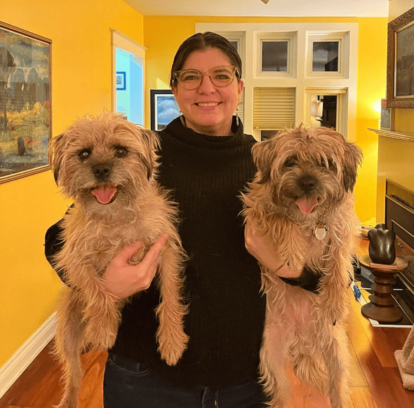

+++
title = "Mutter werden, Frau bleiben – Ein Gespräch über Identität und Veränderung"
date = "2025-02-28"
draft = false
pinned = false
tags = ["Interview", "Identität", "Mutter", "Frau"]
image = "img_7744-2-.png"
description = ""
+++
In diesem Interview teilt eine Mutter ihre persönlichen Erfahrungen mit den Herausforderungen und Freuden des Mutterseins. Sie spricht über die Veränderungen ihres Selbstbildes, die Balance zwischen Mutterrolle und eigener Identität sowie die Freude, trotz der Anfangsschwierigkeiten, an der Mutterschaf.

 Sara Starn ist eine 51 Jährige Frau und Mutter von zwei Kindern. Sie Lebt mit ihrer Familie seit 10 Jahren in Biel <!--StartFragment-->



<!--EndFragment-->

**Nell Rothenbühler: Wie hast du die ersten Tage und Wochen als Mutter erlebt?**

Sara Starns: Mit meinem ersten Kind war es zwar sehr überfordernd, das sind die ersten Momente, die man gar nicht richtig wahrnehmen kann. Man ist einfach so überfordert mit einerseits so großer Liebe und auch einfach Erschöpfung. Nach ein paar Tagen realisierst du, dass du jetzt die Verantwortung für einen Menschen hast und dass es dein Leben verändern wird, aber die Freude, die du auch hast, ist immens. Das habe ich bei meinem zweiten Kind mehr gemerkt als beim ersten, aber beim zweiten konnte man es schon etwas mehr genießen.

**Wie hat sich dein Selbstbild als Mutter verändert?**

Zuerst bist du recht fokussiert auf dein Kind. Ich merkte es gar nicht so. Vor der Geburt war dein Partner der wichtigste Mensch, für den du Verantwortung gefühlt hast, aber mit einem Kind ist das eine ganz andere Sache. Vorher hast du für dich gedacht, und dann kommt noch eine Person dazu, die dir eine ganz neue Lebensperspektive gibt. Das ist auf der einen Seite eine wunderschöne Erfahrung, eine neue Ansicht zu bekommen, aber auch in diesen Momenten vielleicht etwas überwältigend. Ich habe dadurch eine ganz neue Sichtweise bekommen, und das hat mein Selbstbild stark geprägt. Wenn du nicht mehr als einzelne Person denkst, da ist jetzt immer noch eine zweite Person, die Teil dieses Selbstbildes wird.

> Du bist ja trotzdem immer noch eine Person, ein Mensch.

**Hattest du auch Momente, in denen du das Gefühl hattest, dich zu verlieren?**

Dein Fokus ist überhaupt nicht mehr bei dir selbst, sondern komplett beim Kind. Deine eigenen Bedürfnisse werden in den Hintergrund gestellt, und das sollte ja auch so sein. Wenn du Mutter wirst, ist das einfach so. Aber du bist ja trotzdem immer noch eine Person, ein Mensch. Es ist wichtig, Dinge zu machen, die für dich stimmen, und dass du nicht die ganze Last auf das Kind überträgst. Ich merkte, jetzt, wo meine Kinder älter werden und mich nicht mehr für alles brauchen, musste ich den Fokus wieder etwas wegnehmen, sonst können sie keine eigene Identität entwickeln und als eigenständige Menschen wachsen

**Gibt es einen Aspekt deines Lebens, die du vermisst?**

Diese Spontanität. Wenn die Kinder älter werden, kommt sie immer mehr zurück. Wenn sie mehr alleine machen, kannst auch du wieder spontaner sein. Aber wenn sie klein sind, einfach rausgehen und mit Freunden etwas machen – das geht dann einfach nicht mehr. Die Momente mit den Kindern übertrumpfen das aber. Ich habe es überhaupt nicht vermisst, denn die Zeit mit meinen Kindern war es wert

> Wenn du Mutter bist, bleibst du für immer Mutter. Aber du bist Mutter, weil du eine Frau bist, und das muss man anerkennen

**Wie hast du gelernt, dich wieder als Frau und nicht nur als Mutter zu fühlen?**

Eigentlich ist es nichts, aus dem man wirklich herauskommt. Wenn du Mutter bist, bleibst du für immer Mutter. Aber du bist Mutter, weil du eine Frau bist, und das muss man anerkennen. Wenn deine Kinder noch klein sind, ist die Zeit für dich selbst etwas, das einfach nicht mehr existiert. Man merkt schnell, dass man nicht mehr alleine sein kann. Auch wenn ich alleine war oder meine Kinder nicht bei mir waren, konnte ich nicht aufhören, über sie nachzudenken. Das kann man nicht einfach im Kopf abstellen. Aber natürlich, wenn sie noch so klein sind, hat man auch mehr Angst. Wenn sie älter werden und selbst Dinge tun können, denke ich natürlich immer noch an sie, aber es ist weniger. Ich habe viel mehr Platz für andere Gedanken, aber im Hinterkopf ist immer etwas, worüber man nachdenkt

**Gibt es Hobbys, die du jetzt wieder machen kannst, die dir geholfen haben, zu deiner Identität zurückzufinden?**

Ja, ich habe früher immer gerne Tennis gespielt. Nach der Geburt meiner Kinder habe ich das nicht mehr so oft gemacht, aber jetzt wieder. Wöchentlich spiele ich Tennis. Ich liebe es auch zu lesen. Zu sitzen und ein Buch zu lesen, bereitet mir viel Freude. Noch schöner finde ich es, wenn ich es mit meinen Kindern mache – einfach mal am Wochenende alle zusammenlesen und Zeit miteinander verbringen. Das hilft sehr.

**Was würdest du Frauen sagen, die Angst haben, Mutter zu werden?**

Ich habe nicht das Gefühl, dass Muttersein etwas wegnimmt – ich habe das Gefühl, es macht einen noch stärker. Frausein geht Hand in Hand mit Muttersein. Es ist wirklich eine Freude, die man sich gar nicht vorstellen kann. Es dauert vielleicht ein wenig, bis man sich daran gewöhnt hat, aber wenn man es fühlt, kommt es ganz natürlich. Man muss sich trotzdem Zeit für sich selbst nehmen, aber irgendwann findet man wieder zu sich selbst. Am Anfang merkt man, wie man als Mutter sein will, wie man seine Kinder erziehen will. Natürlich ist das etwas, das man mit seinem Partner eng bespricht. Es hilft sehr, wenn man einen guten Partner hat. Mein Mann hat mir in diesen Momenten auch sehr geholfen. Ich hatte vielleicht das Gefühl, dass ich es als Mutter nicht richtig mache, und diese Rolle war manchmal überfordernd, aber das kommt mit der Zeit ganz natürlich. Wenn man sein Kind im Arm hält, merkt man, dass alles, was man verliert, nichts ist im Vergleich zu dem, was man gewinnt."